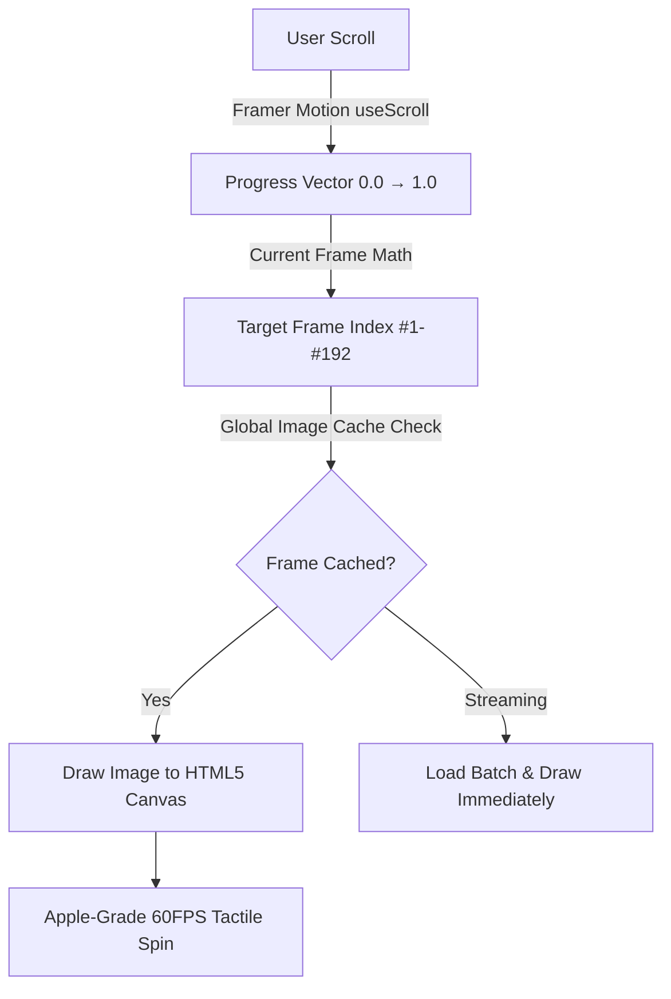

<div align="center">

# ✦ J U I C E R A ✦
### *The Future of Freshness — Bottled in 3D Motion.*

<br />

[](https://nextjs.org/)
[](https://react.dev/)
[](https://www.typescriptlang.org/)
[](https://tailwindcss.com/)
[](https://www.framer.com/motion/)
[](https://juicera-experience.vercel.app/)

<br />

<p align="center">
  <b>A tactile, cinematic e-commerce journey engineered with Apple-grade scrollytelling.</b><br />
  Turn every scroll into a spin. Every drop into an experience.
</p>

<br />

[](https://juicera-experience.vercel.app/)

<br />

---

### 🌐 [Live Demo (juicera-experience.vercel.app)](https://juicera-experience.vercel.app/) • 🍾 [The 3D Scrollytelling Engine](#-the-scrollytelling-canvas-engine) • 🍓 [Flavor Vault](#-the-flavor-vault) • ⚡ [Architecture](#-architecture--tech-stack)

---

</div>

<br />

## 🔮 The Philosophy

> *"We didn't just build a drink storefront. We bottled an interactive, tactile sensory experience."*

Traditional drink websites are static grids of product photos. **Juicera** replaces static pages with a **canvas-driven frame sequence engine**, animating high-fidelity 3D glass bottles in real-time response to the user’s scroll velocity.

From hand-harvested Ratnagiri Alphonso mangoes to Ghanaian cocoa and wild forest strawberries, each bottle is rendered with real-time physical depth, dynamic light refractions, and responsive frosted glassmorphism.

---

<br />

## 🌟 Visual & Technical Highlights

```
┌────────────────────────────────────────────────────────────────────────┐
│                                                                        │
│   ✦ 192-FRAME 3D SCROLL ENGINE ──► 60 FPS Canvas Frame Sequencer       │
│   ✦ GLASSMORPHIC PILL NAV      ──► Dynamic blur & spring expansion     │
│   ✦ ZERO-CONCENTRATE PHILOSOPHY──► 100% Cold-Pressed real fruit        │
│   ✦ SSG PRE-RENDERED ROUTES    ──► Sub-second static page loads        │
│                                                                        │
└────────────────────────────────────────────────────────────────────────┘
```

### 🍾 The Scrollytelling Canvas Engine
* **No Heavy 3D Models:** Instead of loading multi-megabyte glTF/Three.js models that choke mobile GPUs, Juicera deploys a lightweight **192-frame sequence canvas pipeline**.
* **Global Pre-Cache System:** Frame batches load into an in-memory `HTMLImageElement` registry with batch-level UI hydration, completely eliminating lag and white flashes during fast scrolling.
* **HiDPI Retina Scaling:** Automatically detects `window.devicePixelRatio` to render crisp edges on Retina displays without blurry pixel scaling.
* **Scroll-Linked Kinetic Typography:** Floating text overlays reveal nutrition facts, origins, and tasting notes with precision staggered spring physics.

---

<br />

## 🍓 The Flavor Vault

<table>
  <tr>
    <td width="33%" align="center">
      <h3>🥭 Cream Mango</h3>
      <p><i>"Pure Sunshine in Glass"</i></p>
      <br />
      <br />
      
      <br /><br />
      <p>Hand-picked Alphonso mangoes, pressed within hours of harvest to capture unfiltered nectar.</p>
    </td>
    <td width="33%" align="center">
      <h3>🍫 Dutch Chocolate</h3>
      <p><i>"Velvety, Guilt-Free Indulgence"</i></p>
      <br />
      <br />
      
      <br /><br />
      <p>Cold-mixed single-origin Dutch cocoa with daily fresh-pressed almond milk. Zero dairy, zero cholesterol.</p>
    </td>
    <td width="33%" align="center">
      <h3>🍓 Wild Strawberry</h3>
      <p><i>"The Ruby of the Forest"</i></p>
      <br />
      <br />
      
      <br /><br />
      <p>Forest-picked tart sweetness, preserved with patented Berry-Lock ultra-high pressure processing.</p>
    </td>
  </tr>
</table>

---

<br />

## ⚡ Architecture & Tech Stack



| Component | Technology | Purpose |
| :--- | :--- | :--- |
| **Core Framework** | **Next.js 16 (App Router)** | Turbo-charged file-system routing & SSG export |
| **UI Library** | **React 19** | Modern concurrent rendering and hooks |
| **Animation Core** | **Framer Motion** | Scroll interpolation, fluid spring physics & layout morphs |
| **Styles & System** | **Tailwind CSS v4** | CSS-first variables, dark-mode gradients & glass filters |
| **Iconography** | **Lucide React** | Minimalist micro-icons matching the luxury tone |
| **Typography** | **Bricolage Grotesque & Inter** | Editorial headline weight meets modern legibility |

---

<br />

## 📁 Repository Structure

```text
juicera-web/
├── app/
│   ├── [flavor]/
│   │   └── page.tsx              # Static flavor pages with generateStaticParams
│   ├── globals.css               # Tailwind CSS tokens, glows & glass variables
│   ├── layout.tsx                # Root layout, HTML metadata & Google fonts
│   └── page.tsx                  # Home showcase & interactive product switcher
├── components/
│   ├── Navbar.tsx                # Floating glassmorphic capsule with fluid spring scroll
│   ├── Footer.tsx                # Editorial dark luxury footer with newsletter
│   ├── ProductBottleScroll.tsx   # Canvas-based scrollytelling engine (192 frames)
│   ├── ProductPageClient.tsx     # Dynamic flavor state, accordions & buy modal
│   └── ProductTextOverlays.tsx   # Typography triggers synchronized with bottle rotation
├── data/
│   └── products.ts               # Flavor specs, tasting notes & ingredient origins
├── public/
│   └── images/                   # Frame sequence directories for every flavor
├── next.config.mjs               # Static export configuration (output: 'export')
└── tsconfig.json                 # Strict TypeScript configuration
```

---

<br />

## 🚀 Getting Started

### 1. Clone the repository
```bash
git clone https://github.com/LOHITHKUMARN/juicera-experience.git
cd juicera-experience
```

### 2. Install dependencies
```bash
npm install
```

### 3. Launch the development server
```bash
npm run dev
```

Visit [`http://localhost:3000`](http://localhost:3000) to taste the experience.

### 4. Build for Production
```bash
npm run build
```
Creates an ultra-optimized, pre-rendered static export ready for CDN distribution inside the `out/` folder.

---

<br />

## 🛰️ Deployment & Live URL

The project is continuously deployed on **Vercel** Edge Network:

* 🔗 **Live Website**: [https://juicera-experience.vercel.app/](https://juicera-experience.vercel.app/)
* **Preset**: Next.js (App Router, Static HTML Export)
* **Automatic Deployments**: Pushes to `main` automatically trigger production deployments on Vercel.

---

<br />

<div align="center">

Crafted with 🍊, 🍫, and 🍓 • Built for the next era of web design.

**[⬆ Back to Top](#-j-u-i-c-e-r-a-)**

</div>
